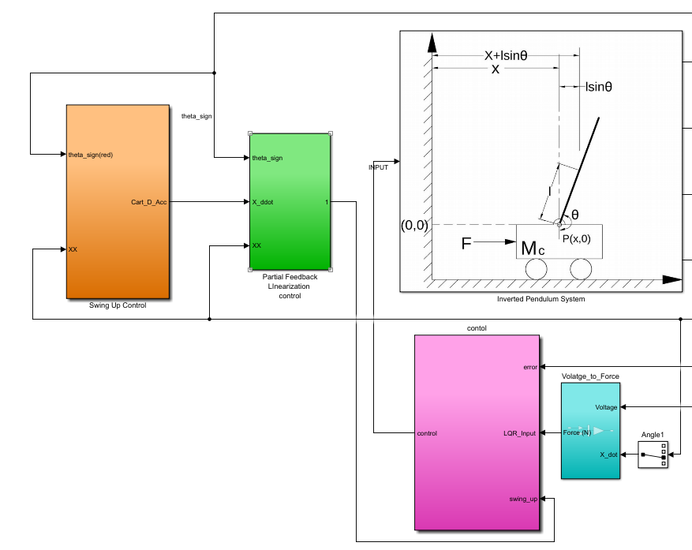
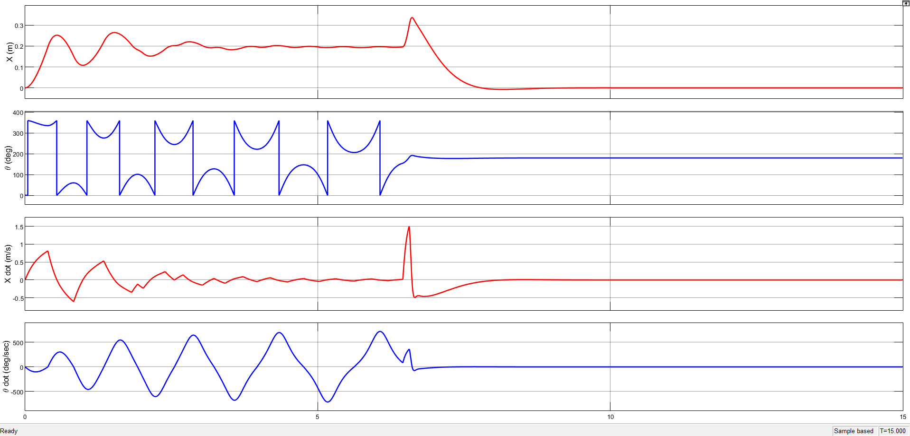

# Inverted Pendulum Simulation & Control 🎢🔧

[](https://github.com/Badredenyx/IPendulum_Simulink/actions)
[](LICENSE)

## 📖 Overview
This MATLAB & Simulink project models and controls an **Inverted Pendulum on a Cart**. It implements a global energy-shaping swing-up controller with partial feedback linearization for large-angle maneuvers, then switches to a local Linear Quadratic Regulator (LQR) for fine stabilization at the upright equilibrium.

**Motivation**: The inverted pendulum is a benchmark for underactuated, unstable systems. Mastering its control strategies—nonlinear swing-up and linear LQR—provides core insights into robotics, automation, and control theory.

**Author**: Badr-Eddine Karafli (ENSA de Kénitra)
**Supervisor**: Prof. Oussama Bouazaoui


## 🚀 Key Features
- **Nonlinear Dynamics**: Euler–Lagrange derivation of pendulum-cart system
- **Energy-Shaping Swing-Up**: Drives pendulum from rest to near-vertical 🔄
- **Partial Feedback Linearization**: Accurate force computation for cart acceleration
- **LQR Stabilization**: State-feedback for upright balance 🤖
- **Hybrid Mode Switching**: Auto-switch when \|θ−π\| < 25°
- **3D Visualization & Plots**: View system response in Simulink scopes
- **Modular Simulink Design**: Separate subsystems for clarity and reuse


## 📋 Prerequisites & System Requirements
- **MATLAB** R2020a or later
- **Simulink** with Control System & Simscape toolboxes
- Windows, macOS, or Linux


## 🔧 Quick Start
1. **Initialize parameters**
   ```matlab
   % From MATLAB prompt:
   run('Init_Setup.m');  % computes gains & initializes all parameters


2. **Run simulation**

   * Open and simulate the model file:

     ```matlab
     % In Simulink:
     open_system('IPendulum_SwingUp.slx');
     sim('IPendulum_SwingUp');
     ```
3. **Monitor** the Scope blocks for angle, position, energy, and control inputs.

## ⚙️ Configuration

All adjustable parameters are found in `config/params.m`:

```matlab
% Physical constants: m, Mc, l, I, g
% Controller gains: energy-shaping k, LQR weights Q, R
% Switching threshold: theta_switch
```

Modify values, then rerun `Init_Setup.m` to apply.

## 📊 Examples & Visualization

### Full Simulink Model

This diagram displays all system blocks and the logic that governs transitions between swing-up and balance control.



> Full Simulink diagram: energy-shaping, PFL, and LQR subsystems

### Closed-Loop Performance

The following plot captures the complete control cycle—from initial swing-up using energy shaping to LQR-based stabilization.



> Closed-loop simulation: smooth transition and balance at upright position

## 🛠️ Contributing

1. Fork the repo 🍴
2. Create a branch (`git checkout -b feature/awesome`)
3. Commit changes (`git commit -m 'Add awesome feature'`)
4. Push and open a Pull Request 🚀

Please include clear descriptions and update tests for new functionality.

## 📜 License

Released under the **MIT License**. See [LICENSE](LICENSE) for details.

---

*For full derivations and detailed theory, refer to the [Project Report (April 2022)](docs/report.pdf).*

```
```
